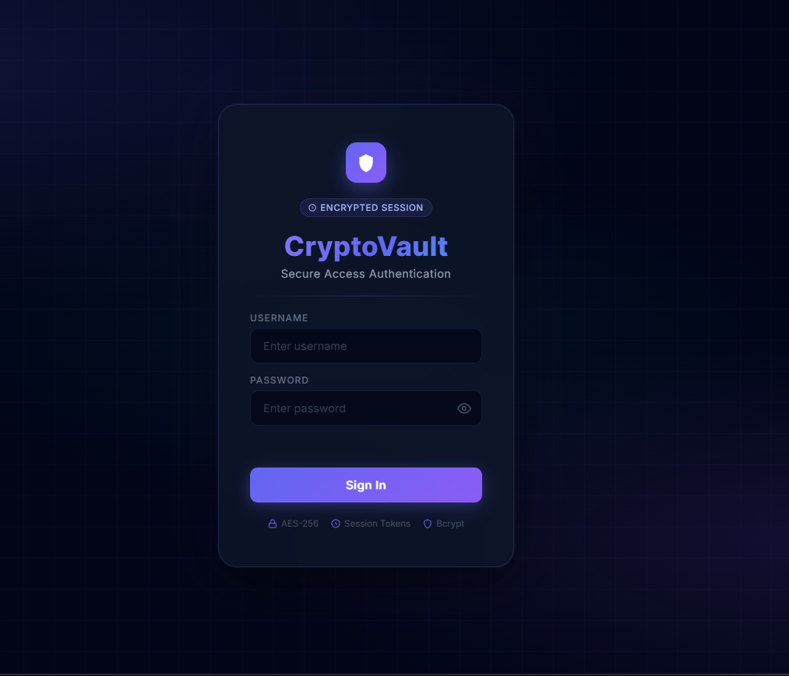
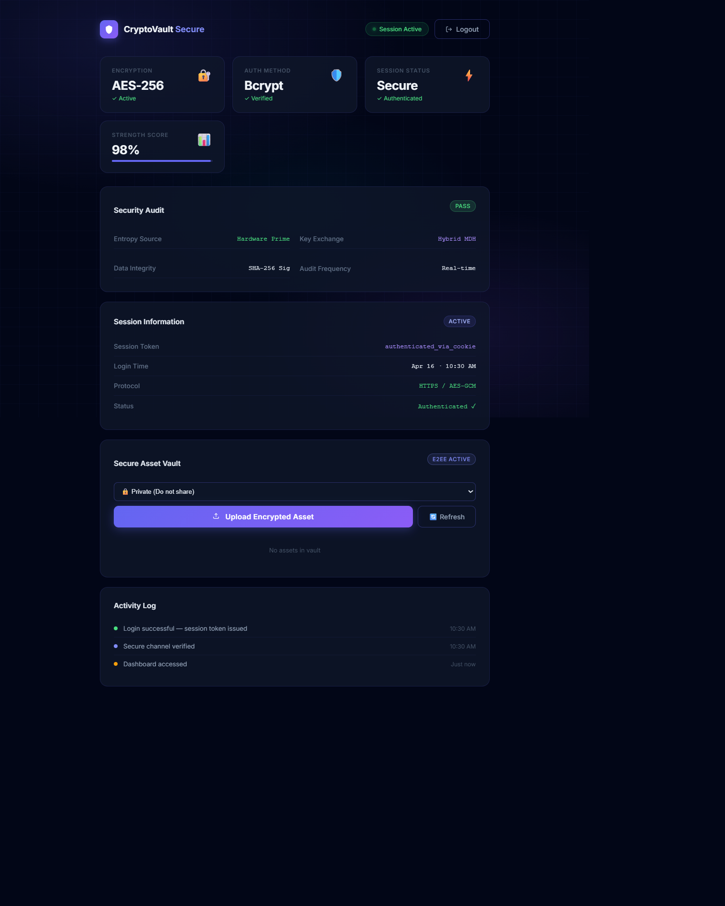

# 🛡️ CryptoVault: Hybrid RSA-MDH Secure Storage

**Professional Secure Multi-User File Repository with Parametric Key Exchange**

[](https://www.python.org/)
[](https://flask.palletsprojects.com/)
[](LICENSE)

---

## 📖 Overview

**CryptoVault** is a hardened cryptographic repository designed to address the security constraints of centralized cloud storage. It integrates **RSA-based Identity Verification** with a custom **Modified Diffie-Hellman (MDH)** handshake to establish a zero-trust environment for multi-user file sharing and persistence.

Unlike standard providers, CryptoVault ensures that raw encryption parameters are never transmitted in cleartext, utilizing a **Pre-Synchronized Parameter Generation (PSPG)** engine to obfuscate base primes during the key agreement phase.

---

## ✨ Key Features

- **🔐 Hybrid Cryptography**: Combines RSA-2048 for identity and MDH for session-based parameter derivation.
- **🤝 MDH Handshake**: Implements a novel mathematical formulation ($P_n = 2P$, $Q_n = P + Q$) for secure base-prime recovery without exposure.
- **📂 Secure Vault**: Encrypted file persistence using AES-256 for data-at-rest.
- **👥 Multi-User Isolation**: Granular access control ensuring files are only visible to owners and authorized recipients.
- **🛡️ MITM Resilience**: Integrated handshake validation to detect interception or modification of public parameters.
- **🎨 Modern UI**: Sophisticated dashboard with real-time security score and activity auditing.

---

## 🏗️ Architecture

CryptoVault operates on a **4-Layer Security Framework**:

1.  **Presentation Layer**: Flask-built dashboard with Jinja2 templating.
2.  **Logic Layer**: User authentication via `bcrypt` and session management.
3.  **Cryptographic Core**: The `MDH` and `RSA` implementation for key derivation and data masking.
4.  **Persistence Layer**: Secure SQLite database with relational mapping (SQLAlchemy).

---

## 🚀 Getting Started

### Prerequisites
- Python 3.10+
- SQLite3

### Installation

1.  **Clone the repository**:
    ```bash
    git clone https://github.com/YourUsername/CryptoVault.git
    cd CryptoVault
    ```

2.  **Install dependencies**:
    ```bash
    pip install -r requirements.txt
    ```

3.  **Initialize the database**:
    ```bash
    python seed.py
    ```

4.  **Run the application**:
    ```bash
    python app.py
    ```
    The vault will be available at `http://localhost:5000`.

---

## 📊 System Screenshots

| Login Interface | Secured Dashboard |
| :---: | :---: |
|  |  |

---

## 🧠 Developed By

Developed by the **HITAM Cybersecurity Research Team**:
- **GP Dhanush**
- **CH Hema Chandra**
- **N. Ashwith Reddy**
- **G. Tanay**

**Institution**: Hyderabad Institute of Technology and Management (HITAM)

---

## 📄 References
- Rivest, Shamir, & Adleman (RSA)
- Diffie-Hellman Key Exchange
- Hussain & Chamoli (Hybrid Cryptographic Approach 2025)

---

© 2026 CryptoVault Team. All Rights Reserved.
